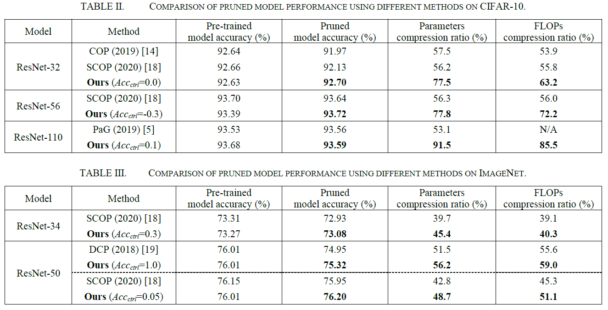

# Automatic Pruning Rate Derivation for Structured Pruning of Deep Neural Networks
Structured pruning method for automatic pruning rate derivation for ICPR 2022  

Pre-trained model for example codes are obtained in following site.  
  Pre-trained model for CIFAR-10: https://zenodo.org/record/5725006#.YZ5cSNDP0uU  
  Pre-trained model for ImageNet: https://github.com/pytorch/vision/blob/main/torchvision/models/resnet.py  
  
<p align="center">

</p>


## Requirements

Automatic Pruner requires:
* Python (>= 3.6.7)
* Torch (>= 1.5.0a0+ba48f58)
* Torchvision (>= 0.6.0+cu101)
* Numpy (>= 1.18.2)
* tqdm (>= 4.62.0)

## Quick start
### Run automatic pruner
1. Move to sample code directory  
```
cd /examples/<sample>
```
2. Download pre-trained model from https://zenodo.org/record/5725006#.YZ5cSNDP0uU to sample code directory  
```
>>> ls /examples/<sample>/*.pt  
pretrained_xxx.pt  
```
3. Execute `run.sh`  
```
chmod +x run.sh && ./run.sh
```
### Run inference with pruned model
1. Move to sample code directory  
```
cd /examples/<sample>
```
2. Download pruned model from https://zenodo.org/record/5725038#.YZ5cY9DP0uU to sample code directory
```
>>> ls /examples/<sample>/*.pt
pruned_xxx.pt
```
3. Execute `run_pruned.sh`
```
chmod +x run_pruned.sh && ./run_pruned.sh

